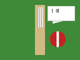

# Cricket Joke

**Q:** Why did the cricket batter bring a reel of string to the match?

**A:** Because he wanted to tie the score before the bowler even had a chance to deliver the punchline!

The sketch shows a cheerful red cricket ball cracking up beside the stumps, proving that even on the pitch a good line and length can still end in a great punchline.
